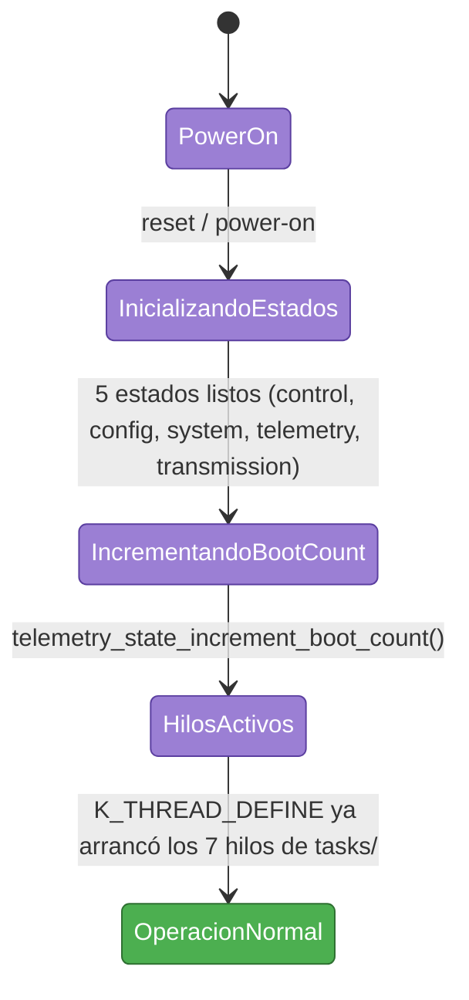
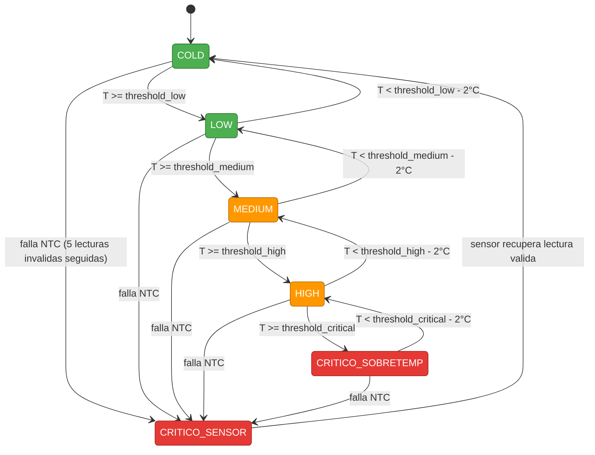
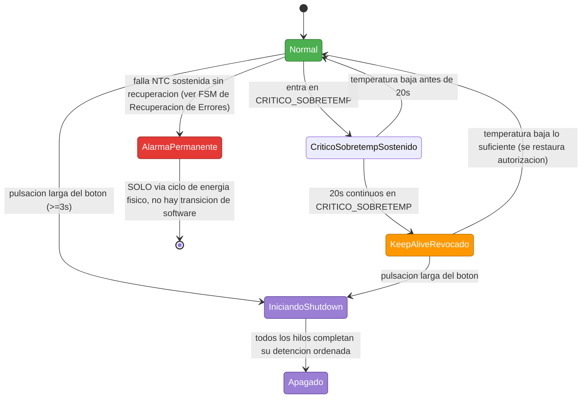
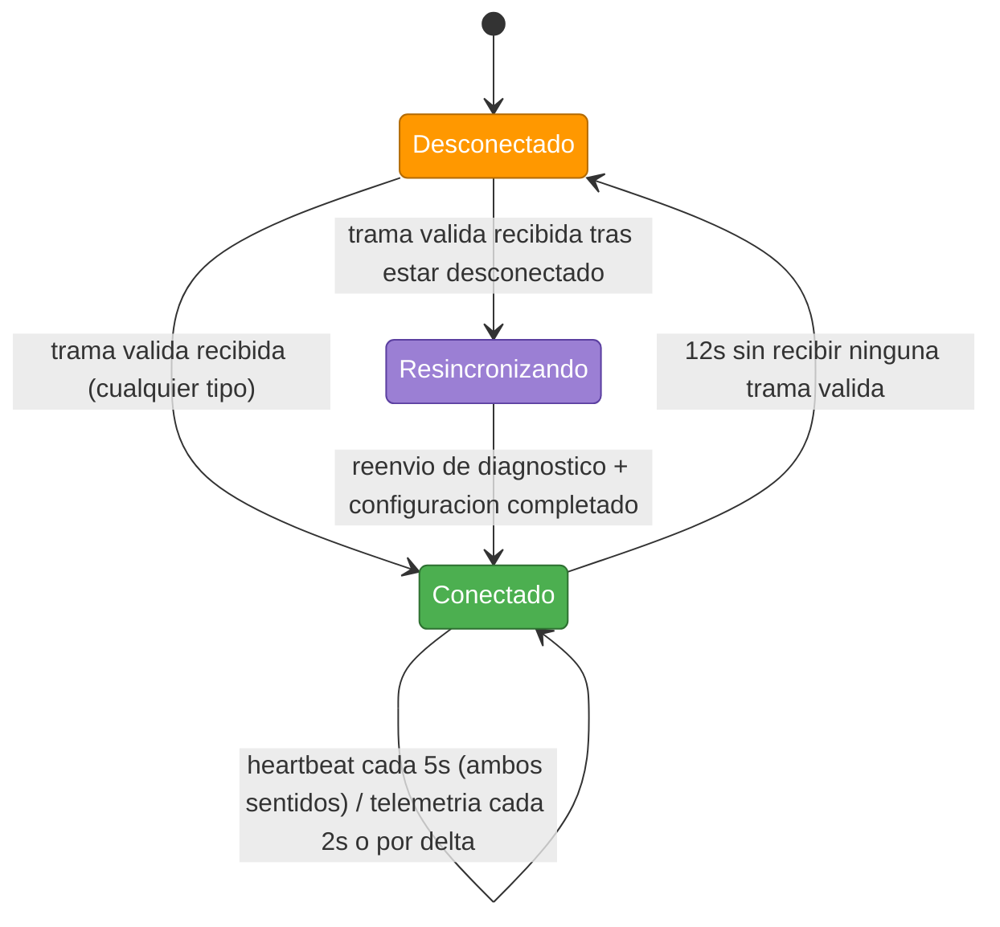
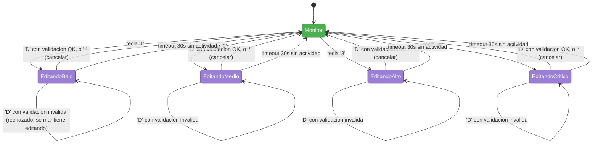
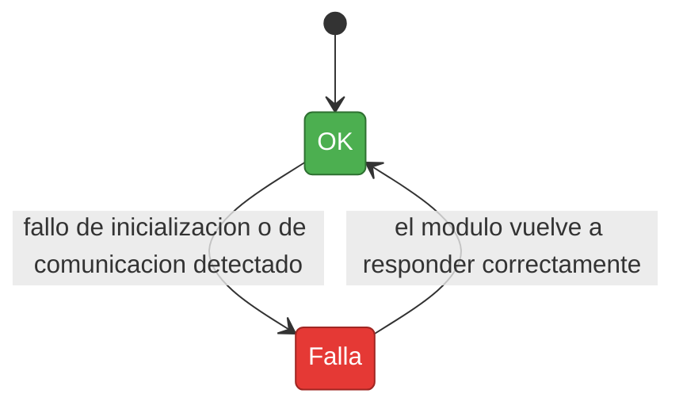
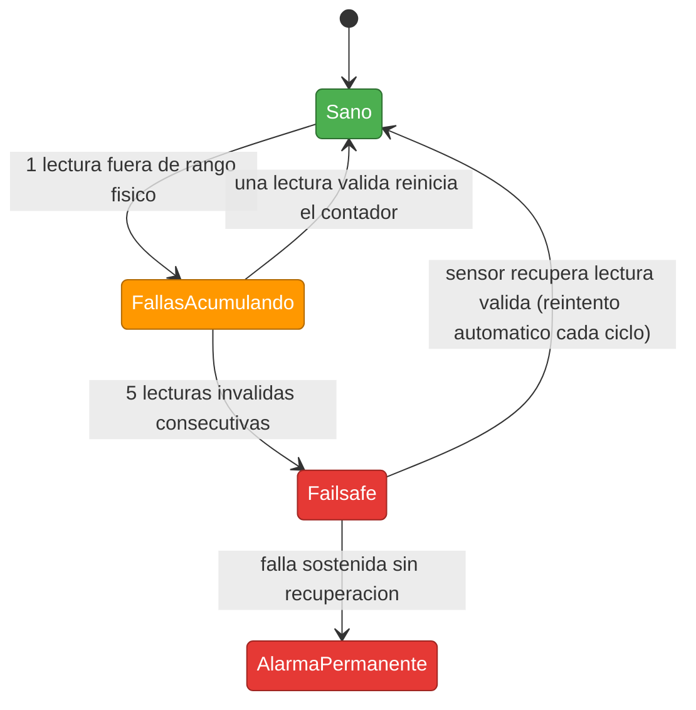

# 03 — Máquinas de Estado

Convención de color usada en todo este documento (para que sea fácil saltar
de un diagrama a otro sin perder el hilo visual): cada FSM tiene su propia
paleta, pero dentro de todas ellas el **verde** siempre significa "operación
normal/sana", el **amarillo/naranja** siempre significa "degradado pero
funcional", y el **rojo** siempre significa "falla / requiere atención". El
**morado** se reserva para estados transitorios (arrancando, resincronizando).

---

## 1. FSM de Arranque

Nota de implementación: los 7 hilos de `tasks/` se registran de forma
estática con `K_THREAD_DEFINE()`, lo que significa que técnicamente pueden
empezar a ejecutarse antes de que `main()` termine de inicializar los 5
estados — `main.c` ya documenta esto como una condición de carrera teórica
pendiente de revisar (ver TODO en ese archivo).

---

## 2. FSM de Gestión Térmica

La histéresis de 2°C se aplica por umbral, no solo entre estados adyacentes —
ver `cooling_manager.c`, función `classify_with_hysteresis()`, para la
implementación genérica que evalúa los 4 umbrales de una sola pasada.
`CRITICO_SENSOR` tiene prioridad absoluta: se puede entrar desde cualquier
estado y no depende en absoluto de la temperatura (que en ese momento no es
confiable).

---

## 3. FSM de Gestión de Alarmas

`AlarmaPermanente` es deliberadamente un estado sin salida por software — ver
`01-system-specification.md` Sección 8 para la justificación. `Apagado` no es
un estado que el firmware pueda "salir" por sí mismo tampoco: la placa queda
con todos los hilos detenidos hasta que alguien corte/restaure la
alimentación físicamente.

---

## 4. FSM de Comunicación ESP32

El sistema arranca en `Desconectado` por diseño — antes de esta sesión de
trabajo, `esp32_connected` se fijaba en `true` incondicionalmente al boot,
lo cual no distinguía entre "conectado de verdad" y "nunca se verificó
nada" (ver `checkpoint.md` Sección 5 para el detalle de ese hallazgo).

---

## 5. FSM de Interfaz de Usuario (OLED + teclado)

Validación al confirmar (tecla 'D'): se exige `BAJO < MEDIO < ALTO < CRÍTICO`
antes de aceptar el cambio — si no se cumple, la edición se rechaza y el
usuario permanece en el mismo modo para corregir (ver
`ui_keypad_task.c`, `process_key_edit()`).

---

## 6. FSM de Recuperación ante Errores (patrón genérico + caso NTC)

Patrón que se repite para cada módulo periférico (OLED, teclado, ESP32) con
su propio bit en `ERROR_FLAG_*`:

Caso específico del NTC, que es el único con una vía hacia Alarma Permanente:

**Punto pendiente marcado explícitamente**: el umbral exacto de "sin
recuperación" que dispara `Failsafe -> AlarmaPermanente` (¿cuántos ciclos de
`Failsafe` sostenido? ¿cuánto tiempo?) no está implementado todavía en
`temperature_manager.c` — hoy el código reintenta la inicialización del ADC
indefinidamente sin nunca escalar a Alarma Permanente por sí solo. Ver
`04-design-decisions.md`, sección de mejoras futuras.
